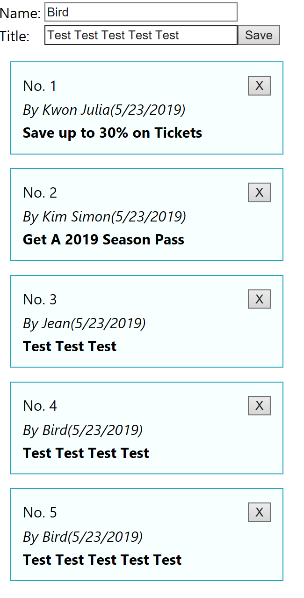
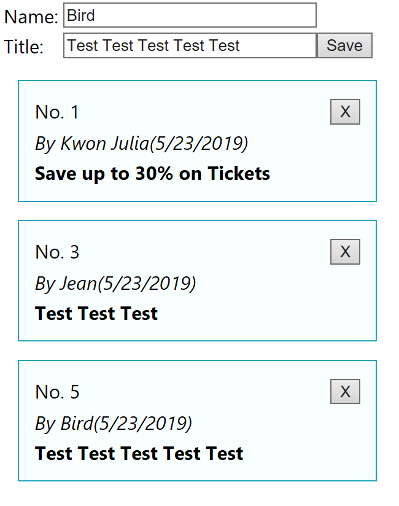

# React_create_simpleBoard

CRUD Board by array

> 1. Description

This board is the simple board that can be create new text, edit and delete the text saved.

The board is stored all data into an array, so if reloaded the webpage from new browser, the data is not stored forever.

> 2. Create App

    create-react-app react_board
    
    cd react_board
    
    npm start
    
> 3. Components 
  
  -- App : the default component to print the board list
  
  -- BoardForm : to return the form to enter new board item or edit the board item selected
  
  -- BoardItem : to find the details for one board item 
  
> 4. Features

- Add data by entering to Form

- Delete data for No.2 and No.4 by clicking X button
 
 
